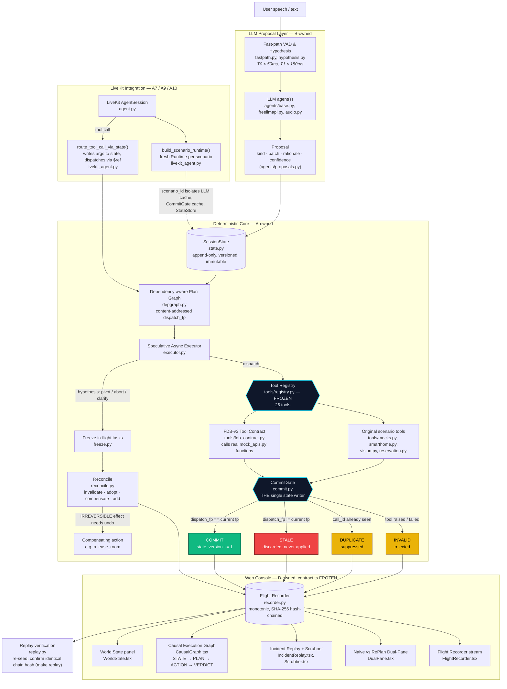

# RePlan: A Commit Gate for Interruptible Voice Agents

> **Team StateShift** · VIT Vellore · Samsung PRISM GenAI Hackathon 2026 · **Theme 05: Interruptible Real-Time Agents**
>
> **Demo video:** [Google Drive](https://drive.google.com/file/d/1YndsB2Jcz9WDvcaM8tGXdfnDzBvDV7bU/view?usp=sharing) · **Slides:** [`docs/VITVellore_StateShift_Submission.pptx`](docs/VITVellore_StateShift_Submission.pptx) · **AI-usage declaration:** 

---

## Demo video

**Watch on Google Drive:** https://drive.google.com/file/d/1YndsB2Jcz9WDvcaM8tGXdfnDzBvDV7bU/view?usp=sharing

## 1. Summary

Voice agents fail in one specific way: a user changes their request mid-task ("Chicago… actually, Seattle"), but a tool call started *before* the change is still running. When its result returns, most systems apply it anyway.

RePlan does not try to make the model smarter. It adds a **commit gate**: every tool result carries the fingerprint of the state it was computed against, and it is applied **only if that fingerprint still matches the current state**. Otherwise it is rejected as `STALE` and never reaches the user or the state.

| What we built | Where |
|---|---|
| A deterministic runtime with a single state writer and a content-addressed commit gate | `replan/commit.py`, `replan/runtime.py` |
| A LiveKit voice agent that routes every tool call through that gate | `agent.py`, `replan/livekit_agent.py` |
| A second use case (in-car navigation) that uses the same gate | `python replan/livekit_agent.py --scenario incar` |
| A reproduction script that runs the FDB-v3 benchmark against the agent end to end | `reproduce_fdb_v3.sh` |
| A console that replays a recorded session step by step | `web/` |

---

## 2. What is new in this approach

- **The check is about the data, not the clock.** A result is accepted or rejected by comparing fingerprints of the request and the state, never by arrival order or a timeout.
- **One writer.** Only `CommitGate` changes committed state. This is enforced by the build (`make check` rejects bypass patterns) and by tests.
- **Irreversible actions are never speculative.** The executor won't start them until their inputs are confirmed.
- **Every decision is recorded.** The event log is hash-chained, so a run can be replayed and verified (`make replay`).
- **The same gate covers different domains.** The flight search and the in-car navigation use identical logic; only the tools differ.

---

## 3. Architecture

The diagram below shows the full pipeline. Everything above the gate may be wrong, speculative, or cancelled. Only results that pass the gate change state.



**Components in the live voice path:**
- **Gemini 2.5 Flash native audio** (via `GOOGLE_API_KEY`) handles speech in and out and decides when to call a tool.
- **Each tool call** writes its arguments into state and creates a task whose arguments refer to that state, so a later correction makes the task stale.
- **The settle loop** announces a result only after the gate commits it. The announcement waits for the agent to be idle and retries if generation fails.
- **Tool-call records** are written in the format the benchmark scorer reads, so every call is counted.

**Tool surface** (`replan/tools/registry.py`): 26 declared tools. Twelve are the Full-Duplex-Bench v3 scored tools, wired directly to the benchmark's own mock functions (`replan/tools/fdb_contract.py`). The other fourteen cover the original hotel, smart-home, and in-car scenarios.

---

## 4. Demonstrations

Each demonstration is a command you can run. The first is the core proof; the others show the same rule in other settings.

### 4.1 Random-city proof (terminal)

```bash
python3 -c "import random; print(random.choice(['Boston','Austin','Denver','Seattle']))"
FDB_V3_PATH=/path/to/Full-Duplex-Bench/v3 python replan/livekit_agent.py --to-city <city>
```

The city is picked at random, so the outcome is not known in advance. The Chicago search is marked `stale`, the new search is `commit`, and the final state holds only the new city.

### 4.2 In-car navigation (second use case, terminal)

```bash
python replan/livekit_agent.py --scenario incar --to-destination Denver
```

A route to Chicago is started, and the destination changes to Denver before the route is confirmed. The Chicago route is rejected as stale, and only the Denver route becomes active. Cancellation of an already-applied route is part of the design but is **not demonstrated** here; it requires the full reconciliation path.

### 4.3 Live voice (LiveKit console)

```bash
python agent.py console
```

Ask for a flight, then correct it after the first result. The first search completes before the correction, so the correction runs a new search and only the new result is spoken. The terminal shows each tool call, dispatch, and verdict.

### 4.4 Console walkthrough (web)

```bash
cd web && npm install && npm run dev   # http://localhost:5173
```

The page replays one recorded session. Step through it with the slider or **Next**, and open the stale row to see its reason. The page is a replay, not a live view of the agent.

---

## 5. Benchmark: Full-Duplex-Bench v3

FDB-v3 contains 100 recorded human requests across four domains and three difficulty levels. Each request is scored on the tool calls it should produce and their arguments. The benchmark does not interrupt the agent, so this measures how well the agent handles a whole request, including self-corrections inside the request.

**Final run, final code** (`results/20261004-210839`, all 100 examples scored, local scorer without the LLM judge):

| Measure | Our agent | Raw Gemini baseline | Difference |
|---|---|---|---|
| Responded at all | 94 / 100 | 99 / 100 | −5 |
| Tool selection accuracy | **90.9%** | 85.4% | +5.5 |
| Argument accuracy | 39.4% | 50.5% | −11.1 |
| Overall pass rate | 28% | 44% | −16 |
| Self-correction pass rate | **52.9%** | 35.3% | +17.6 |
| Pass rate with a state rollback | **52.9%** | 35.3% | +17.6 |
| Pass rate without a state rollback | 22.9% | 45.8% | −22.9 |
| Average latency (turn-taken) | 12.5 s | 12.4 s | — |

**By domain (tool selection / argument accuracy):** ecommerce 86.1% / 59.8%, finance 95.3% / 50.7%, housing 81.2% / 16.0%, travel 87.0% / 17.5%.

**How to read this:**
- Tool choice and self-correction are better than the raw model. The self-correction sample is small, so it is a signal rather than a proof.
- Argument accuracy and overall pass rate are below the raw model. Much of the argument gap is formatting (for example "keyboard" for "keyboards"), which the official LLM judge may accept. The local scorer is stricter than the official one, so these numbers are a lower bound on argument accuracy.
- Six requests got no spoken response. This is the most important bug to fix, since a silent request scores zero.

**Reproduce it:**

```bash
./reproduce_fdb_v3.sh                       # full run, about 2 hours
DRY_RUN_SECONDS=600 ./reproduce_fdb_v3.sh   # 10-minute check
```

The script installs what is missing, starts the agent, runs the benchmark against it, scores the run without the LLM judge, and stops the agent. It needs a `.env` with `LIVEKIT_URL`, `LIVEKIT_API_KEY`, `LIVEKIT_API_SECRET`, and `GOOGLE_API_KEY`. The benchmark data is downloaded from the link in the FDB-v3 README if it is not already present.

---

## 6. Limitations

- **Argument formatting** is the largest gap. The agent sometimes reformats values the user said exactly.
- **Six silent requests** in the final run, which we have not yet traced.
- **Compensation** of an already-applied route is designed but not demonstrated.
- **The live voice correction** usually arrives after the first search has finished, so it shows a new search rather than a rejected result. The rejection is shown by the terminal demonstrations.
- **The console** replays a recorded session; it does not show live agent events.
- **The reproduction script** has been run on the authors' Mac, not yet on a clean machine.

Full detail is in [`LIMITATIONS.md`](LIMITATIONS.md) and [`ARCHITECTURE.md`](ARCHITECTURE.md).

## 7. Next steps

1. Trace and fix the six silent requests.
2. Improve argument fidelity: copy identifiers, values, and dates exactly as spoken.
3. Connect compensation to the live voice path, so an applied route can be cancelled.
4. Bridge the live agent to the console, so the page follows the session.
5. Run the reproduction script on a clean machine.

---

## 8. Quickstart

**Prerequisites:** Python 3.11+, Node.js 18+, and (for the benchmark) Git, Python 3.10, and ffmpeg.

```bash
git clone https://github.com/LAKSHYA2517/Replan.git && cd Replan
python3.11 -m venv .venv && source .venv/bin/activate
pip install -e ".[dev]"

make check      # repository constraints
make test       # 100 acceptance tests
make demo       # signature scenario, deterministic, no network
make replay     # bit-for-bit replay verification
```

Copy `.env.example` to `.env` and fill in the keys you need. The core runtime and tests need no keys. The live demonstrations need `GOOGLE_API_KEY`; the LiveKit ones also need the three `LIVEKIT_*` variables.

---

## 9. Make targets

| Target | Purpose |
|---|---|
| `make check` | Enforces repository constraints (no bare clocks, no threads, no commit-gate bypass flags) |
| `make test` | Runs the acceptance tests |
| `make demo` | Signature scenario, deterministic |
| `make replay` | Verifies replay equivalence |
| `make bench` | Factorial sweeps over chaos levels and latency profiles |

---

## 10. Guide for judges

1. **The commit gate:** `replan/commit.py`. Results are applied only if their fingerprint matches the current state.
2. **The live voice agent:** `agent.py`. Every tool call goes through the gate; the settle loop announces only committed results.
3. **The terminal adapter:** `replan/livekit_agent.py`, with the flight demo and the in-car demo.
4. **The benchmark integration:** `replan/tools/fdb_contract.py` calls the benchmark's own mock functions directly.
5. **The reproduction script:** `reproduce_fdb_v3.sh`.
6. **The console:** `web/src/views/`. It replays a recorded session; the views are `CausalGraph.tsx`, `WorldState.tsx`, `DualPane.tsx`.
7. **Tests:** `tests/`, 100 passing.

---

## 11. Submission materials

| Item | Link |
|---|---|
| Demo video (under 5 minutes) | [Google Drive](https://drive.google.com/file/d/1YndsB2Jcz9WDvcaM8tGXdfnDzBvDV7bU/view?usp=sharing) |
| Slides | [`docs/VITVellore_StateShift_Submission.pptx`](docs/VITVellore_StateShift_Submission.pptx) |
| AI-usage declaration | [`docs/stateShift_declaration_form_filled_final.pdf`](docs/stateShift_declaration_form_filled_final.pdf) |
| Architecture notes | [`ARCHITECTURE.md`](ARCHITECTURE.md) |
| Limitations | [`LIMITATIONS.md`](LIMITATIONS.md) |

---

## 12. Repository map

```
replan/        core runtime: state, commit gate, executor, recorder, replay, LiveKit adapter
agent.py       live LiveKit voice agent (Gemini native audio)
web/           console: replay of a recorded session
tests/         acceptance tests
docs/          slides and declaration form
reproduce_fdb_v3.sh   one-command benchmark reproduction
```
